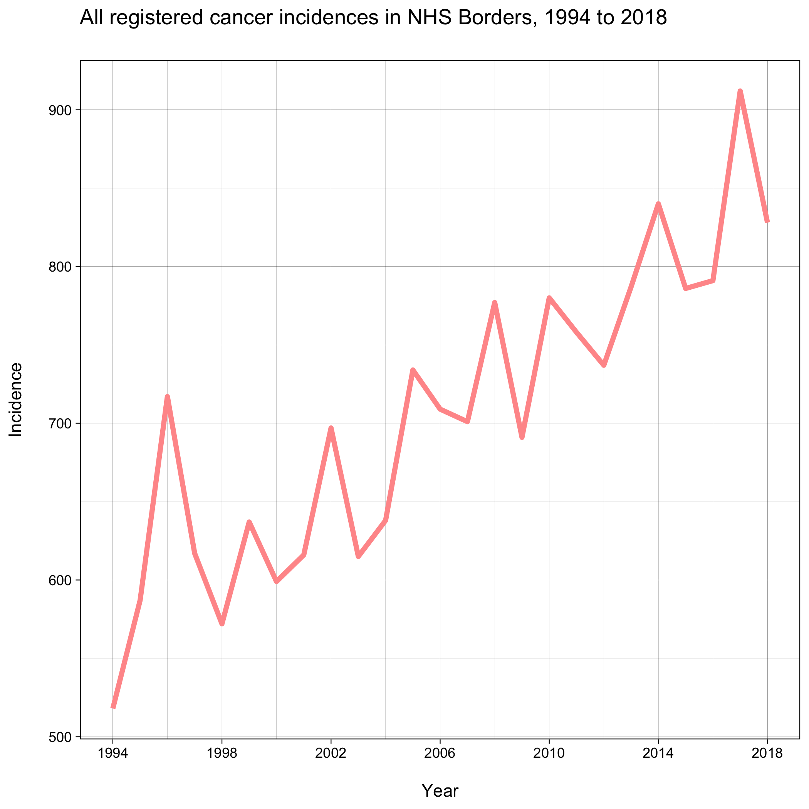
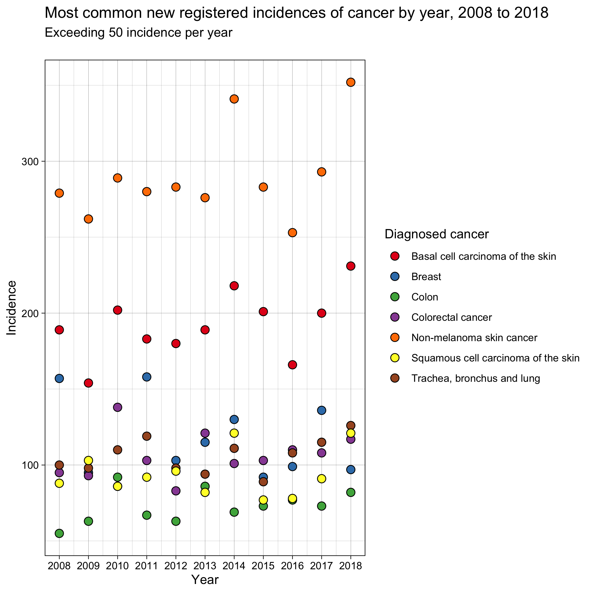
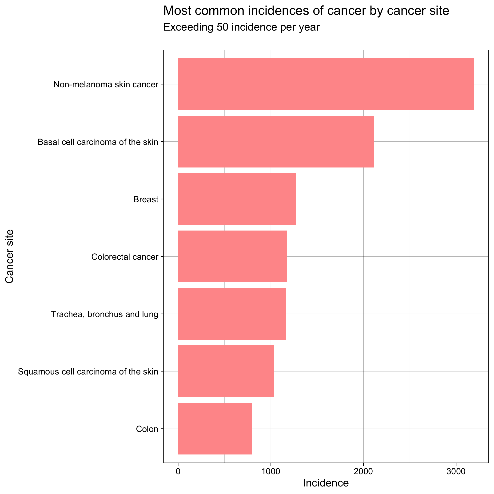
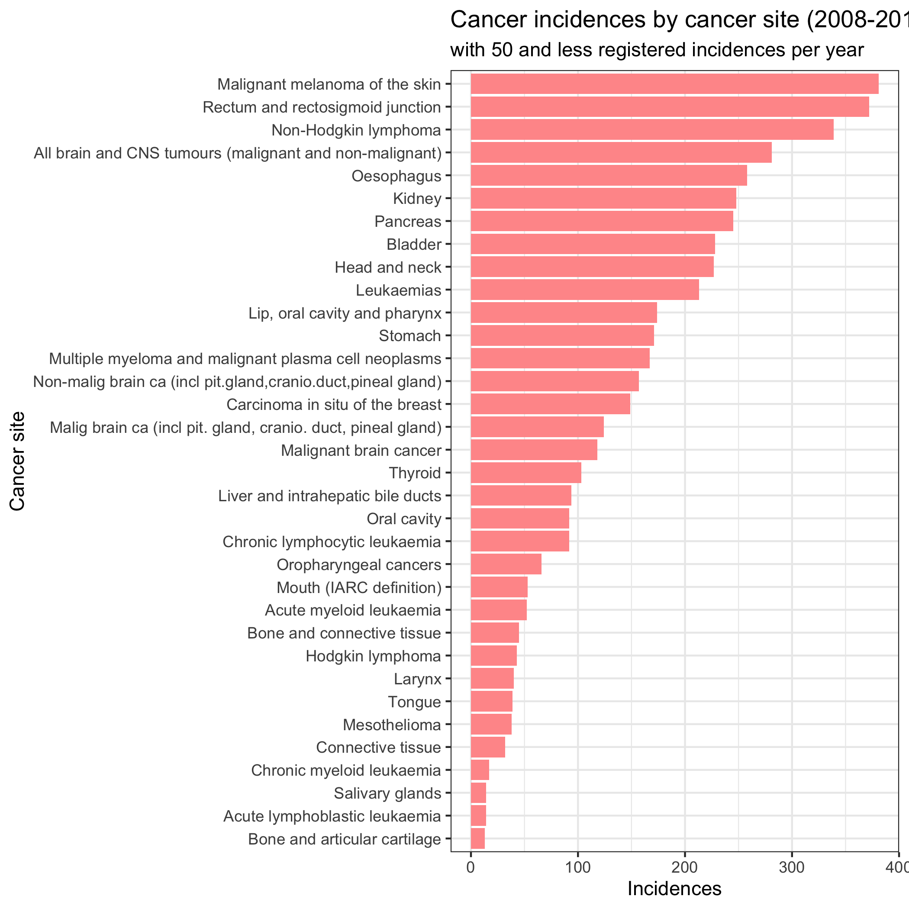

# Cancer Rates in the Borders

## Overview of the problem

The analysis aims to help inform the planning for the supply of cancer treatment services in NHS Borders. It seeks a better understanding of the number of individuals who develop or experience cancer during a particular period at this specific area. 

## Data and modeling approach

The two datasets used for the analysis were sourced from [opendata.nhs.scot](https://www.opendata.nhs.scot/).

The first dataset covers all registered cancer incidences in Scotland by the health board of residence, since 1992.
The second dataset contains geography codes and labels, which allowed us to look in the first dataset for the data relevant to the NHS Borders' health board.

To gain a better understanding of the incidence of cancer. At first, we get an overview of the pattern by looking at the total number of new cancer registrations over a longer period, from 1994 to 2018. Then, we look closer at the ten year data period which more accurately reflects the information required to help planning for the provision of cancer treatment services.

## The results of data analysis

#### 1) All registered cancer incidences in NHS Borders, between 1994 and 2018.

The line graph illustrates how the total number of all cancer registrations changed over 24 years. The x-axis shows the period and the y-axis shows incidence. 

As can be seen from the graph, the incidence of cancer overall increased throughout the time. Starting with 518 incidences in 1994 and ending with 828 incidences in 2018. The most significant increase of 130 new cancer registrations was from the year 1995 to 1996.

#### 2) Most common new cancer site registrations in NHS Borders by year, from 2008 to 2018. It covers only diagnosed cancer sites with over 50 incidences per year.

The scatter plot illustrates the pattern of the most commonly registered incidences of cancer per specific year. The differently colored points correspond to the year which is on the x-axis and the number of incidences on the y-axis.

According to the information, the number of incidences of particular cancer site does not fluctuate significantly from year to year but rather flactuate slightly whithin certain levels.

#### 3) Most common incidences of cancer over ten year period, 2008 to 2018

This flipped bar graph displays the most commonly reported incidences of cancer per diagnosed cancer site over ten year period. The graph is a summary of all the cancer sites which are exceeding 50 incidences per year.

The cancer site with the highest number of new registrations was 'Non-melanoma skin cancer' with 3191 registrations.
The second most commonly diagnosed cancer was 'Basal cell carcinoma of the skin' with 2113 registrations. 
Further, 'Breast', 'Colorectal', 'Trachea, bronchus and lung', and 'Squamous cell carcinoma of the skin' had each over 1000 new registions in the NHS Borders.

#### 4) Sum of all new cancer registrations by the diagnosed cancer site between 2008 to 2018 in NHS Borders. It covers only diagnosed cancer sites with 50 and fewer incidences per year.

The bar graph displays cancer sites with 50 and fewer registered incidences per year. The graph displays summary of the incidences over the ten years per specific cancer site.

This graph highlights that a significant portion of diagnosed cancer sites has a lower number of registrations per year.




## Conclusion

The number of cancer incidences rose over the past 24 years in NHS Borders.

According to the information, the number of incidences of particular cancer site does not fluctuate significantly from year to year but rather flactuate slightly whithin certain levels. This may to an extend help when making predictions, however, further analysis are required.

It is clear that the most commonly diagnosed cancer types in the NHS Borders over ten years were 'Non-melanoma skin cancer' and 'Basal cell carcinoma of the skin'. 
In addition, four cancer sites had each over 1000 cancer incedences registered. Speaking of: 'Breast', 'Colorectal', 'Trachea, bronchus and lung', and 'Squamous cell carcinoma of the skin'.

It is highlighted that a significant portion of diagnosed cancer sites has a lower number of registrations per year.

According to the ten-year data, there were 41 types of diagnosed cancer incidences in NHS Borders. Seven of these were had each over 800 instances and 34 had each under 400 instances. 
