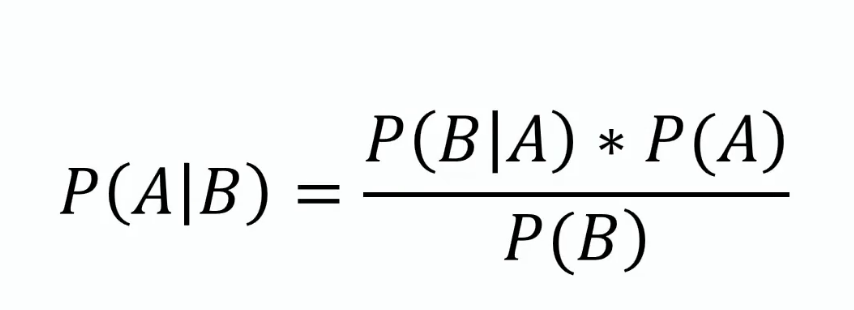
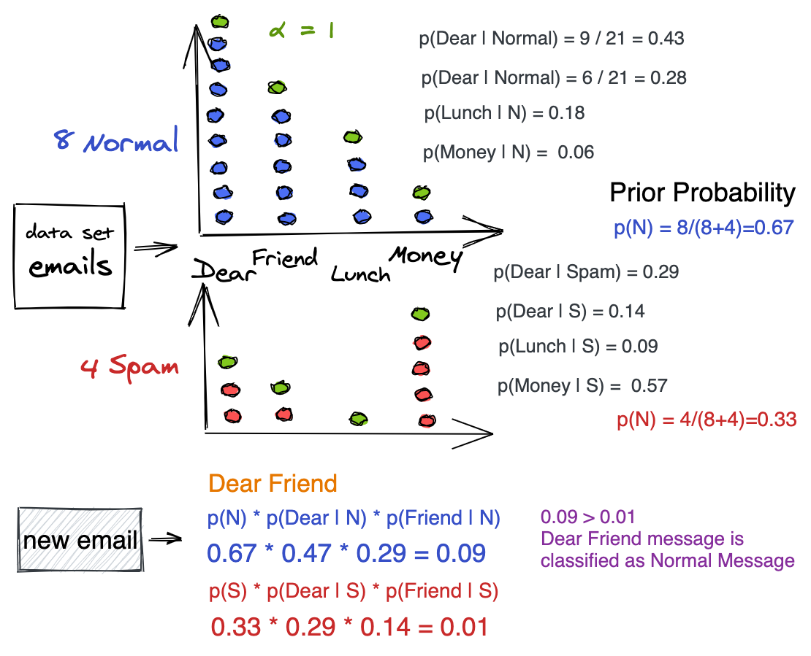

# 1 Classification and clustering - two fields of machine learning

## 1.1 Differences

|Classification|Clustering|
|---|---|
|A Supervised Learning technique|An unsupervised Learning technique|
|Goal of assigning new input to a class|Goal of finding simillarities within a given dataset|
|Infinite set of input data|Finite set of data|
|Specific class labels|Do not have labels|
|Requires a training dataset|No training or test data split|
|Algotithm: Logistic Regression|Algorithm: K-means|
|Example: Classify emails as spam or non-spam|Example: Find all transactions which are fraudulent in nature|

# 2 Naive Bayes
Two types:

- Multinomial Naive Bayes Classifier
- Gaussian Naive Bayes Classification

## 2.1 What is Naive Bayes algorithm?

- A classification algorithm
- A simple probabilistic classifier 
- __Based on__ Bayes theorem that is used to find the probability of a hypothesis with given evidence.
- __Assumes__ that the presence of a particular feature in a class is unrelated to the presence of any other feature.  

## 2.2 How it works

### Bayes theorem:

In this, we can find the probability of A, given that B occurred. A is the hypothesis and B is the evidence.

P(B|A) is the probability of B given that A is True.

P(A) and P(B) is the independent probabilities of A and B.

### Equation:

## 2.3 Strengths
- _Easy_ to build
- It is a resource efficient algorithm that is fast and scales well
- Useful for very large data sets
- It perform well in case of categorical input variables
- If predictors are independent it performs better than logistic regression and needs less training data
- It works well in practise, hence it has _low variance_

## 2.4 Weaknesses
- If categorical variable has a category (in test data set), which was not observed in training data set, then model will assign a _0 (zero) probability_ and will be _unable to make a prediction_.
- Strong assumptions regarding independence as in real life, it is _almost impossible_ that we get a set of _predictors_ which are _completely independent_.
- By ignoring relationships among predictors (example: words) it has _high bias_.

## 2.5 Suitable areas of application

- Used for __Real time Prediction__ in marketing as it is a eager learning classifier and it is 'certain' fast
- __Multi class Prediction__ - can predict multiple classes of target veriable
-  __Text classification__ / __Spam Filtering__ / __Sentiment Analysis__ (used in social media, to identify positive and negative customer sentiments)
- __Recommendation System__ - Naive Bayes with Collaborative Filtering builds a Recommendation System that filter unseen information and predict whether a user would like a given resource or not

## 2.6 Example

# 3 References

[Naive Bayes, Clearly Explained by StatQuest with Josh Starmer](https://www.youtube.com/watch?v=O2L2Uv9pdDA)

[4 Types of Classification Tasks in Machine Learning](https://machinelearningmastery.com/types-of-classification-in-machine-learning/)

[A Guide to the Naive Bayes Algorithm
](https://www.analyticsvidhya.com/blog/2021/01/a-guide-to-the-naive-bayes-algorithm/)

[6 Easy Steps to Learn Naive Bayes Algorithm with codes in Python and R](https://www.analyticsvidhya.com/blog/2017/09/naive-bayes-explained/)

